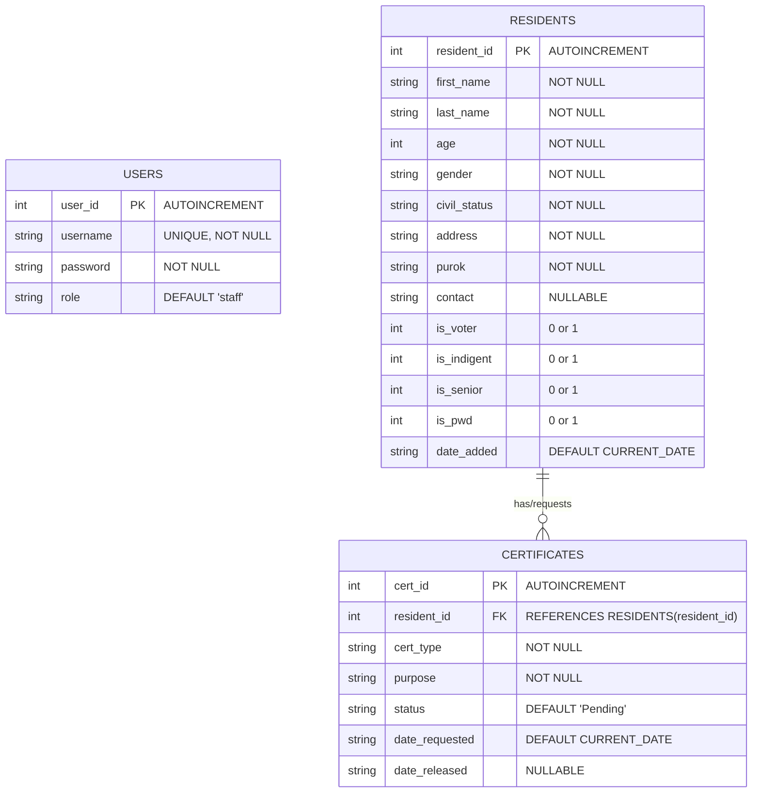
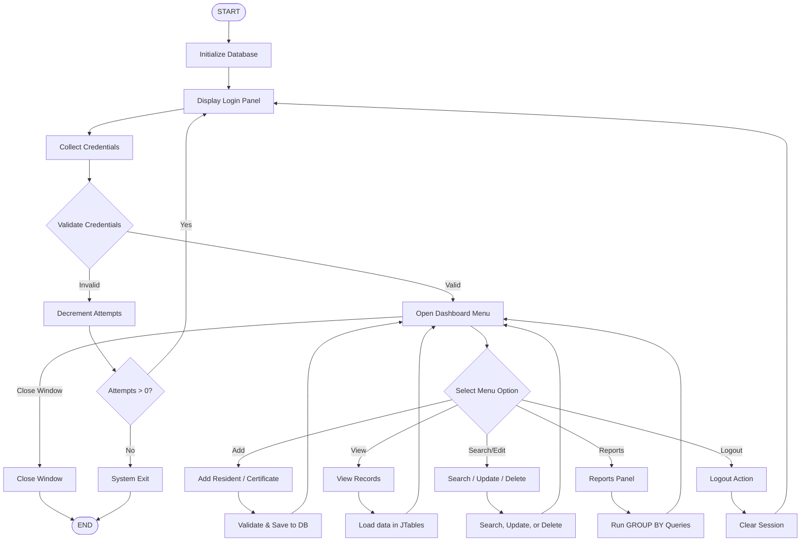

# FINAL PROJECT REPORT: BARANGAY RECORD MANAGEMENT SYSTEM (BRMS)

**Course:** Object-Oriented Programming with Database Integration  
**Course Code:** OOP-DB-2025  
**Polytechnic University of the Philippines**  

---

## 1. Title Page

* **Project Title:** Barangay Record Management System (BRMS)
* **Subject:** Object-Oriented Programming
* **Course/Section:** [Insert Course e.g., BSIT 2-1 / BSCS 2-2]
* **Group Number:** Group [Insert Group Number]
* **Group Members:**
  1. [Member Name 1]
  2. [Member Name 2]
  3. [Member Name 3]
  4. [Member Name 4]
  5. [Member Name 5]
* **Instructor's Name:** [Insert Instructor's Name]
* **Date Submitted:** June 8, 2026

---

## 2. Introduction

### 2.1 Background
The barangay is the primary planning and implementing unit of government policies, plans, programs, projects, and activities in the community, serving as the frontline of public service delivery in the Philippines. Despite the rapid progress of digital transformation in municipal and national agencies, local barangay administrations continue to rely heavily on manual logbooks, paper record cards, and traditional filing cabinet systems. 

Manual record-keeping introduces severe administrative bottlenecks, including the slow retrieval of resident records, high risk of physical record damage or loss, duplicate entries, inconsistent reporting, and delayed certificate issuance workflows. Furthermore, the lack of internet connectivity in many rural or developing barangay offices prevents them from adopting cloud-based government platforms.

### 2.2 System Purpose
The **Barangay Record Management System (BRMS)** is a desktop-based, offline-capable information system developed in Java with a local SQLite database. It is designed to modernize and digitize the administrative records of local barangay offices. 

By transitioning manual records to a relational database, BRMS enables barangay administrators to:
1. Store and manage structured resident profiles.
2. Issue and track municipal certificate requests.
3. Automatically flag specific profiling identifiers (e.g., indigent status, senior citizens, PWDs).
4. Generate analytical demographic reports for community planning.

The system is developed entirely without external network dependencies, ensuring local governments can run it reliably under any connectivity conditions.

---

## 3. Objectives of the System

The Barangay Record Management System is designed to achieve the following core objectives:

1. **Digitize Barangay Profiling:** To replace manual paper cards with a secure local SQLite database, establishing a centralized database for resident records.
2. **Automate Certificate Workflows:** To implement a request-to-release workflow for key documents (Barangay Clearance, Indigency Certificate, and Residency Certificate) with automatic timestamps.
3. **Enhance Social Welfare Tagging:** To support national assistance programs by profiling residents with specific indicators (Voter, Indigent, Senior Citizen, PWD), automatically detecting senior citizen status if the age is 60 or above.
4. **Enable Data-Driven Decisions:** To produce aggregated statistics including purok population breakdowns, monthly certificate volume trends, and demographic profiles to aid local planning.
5. **Demonstrate Clean OOP Architecture:** To write modular, extensible, and clean code that strictly adheres to the core principles of Abstraction, Encapsulation, Inheritance, Polymorphism, Exception Safety, and Java Collections.
6. **Provide a Secure, Easy-to-Use UI:** To secure the system with credential-based login containing attempt limits and implement an elegant Swing GUI with responsive sidebar menus.

---

## 4. Scope and Limitations

### 4.1 Scope
* **Resident Profile Management (CRUD):** Creating, viewing, searching, updating, and deleting resident profiles.
* **Certificate Issuance & Lifecycle Tracking:** Requesting certificates and marking them as *Pending*, *Approved*, or *Released* (releasing updates the `date_released` column automatically).
* **Demographic Profiling:** Checkboxes to indicate if a resident is a Registered Voter, Indigent, or PWD. Senior Citizen status is calculated automatically based on the resident's age.
* **Analytical Reports:** Generates real-time tables showing population totals per Purok, monthly certificate demand trends, and demographic breakdowns (Minors, Adults, Seniors).
* **Credential Authentication:** A secure login panel restricting access. The database inserts a default admin user (`admin` / `admin123`) on its initial run.
* **Data Security & Injection Defense:** Implements prepared statements throughout all database commands to block SQL injection attacks.

### 4.2 Limitations
* **Single Station Offline Database:** The system uses SQLite. It is built as a single-user desktop application; network synchronization and multi-user concurrency are not supported.
* **Console-Style Print Previews:** The system manages data, tracks requests, and generates analytical reports on-screen, but it does not interface with physical printers or export to external PDF/Word documents.
* **No Advanced Security Protocols:** Passwords are stored in plain text for demonstration purposes; production deployments would require hashing functions like bcrypt.
* **No Blotter or Incident Tracking:** The system is dedicated to profiling and certificates; incident reporting and judicial blotters are outside the current scope.

---

## 5. System Features

| Feature Module | Functionality Description |
| :--- | :--- |
| **Login Authentication** | Restricts application startup. Collects username and password and validates them against the database. The system locks down and exits after 3 consecutive failed login attempts. |
| **Add Resident** | Captures First Name, Last Name, Age, Gender, Civil Status, Address, Purok, and Contact. Provides checkboxes for PWD, Indigent, and Voter status. Auto-flags Senior Citizen if age $\ge 60$. |
| **Add Certificate** | Links certificate requests to a valid Resident ID. Supports Barangay Clearance, Indigency, and Residency certificates, collecting custom fields (e.g., purpose, duration of residency). |
| **View Records** | Displays tabular data for all residents, certificate lifecycles, and barangay officials. Supports sorting and alternating row highlight colors. |
| **Search Record** | Offers filtering options. Search for residents using ID, Name keywords, or Purok locations. |
| **Update Record** | Modifies resident demographics and certificate lifecycles. Checks that records exist before committing changes. Releasing certificates automatically stamps the current date. |
| **Delete Record** | Deletes records after user confirmation. Incorporates a database transaction to delete a resident's certificates first before removing their profile, maintaining database integrity. |
| **Report Generation** | Processes database counts using group-by clauses to display live purok population metrics, monthly request rates, and age bracket percentages. |

---

## 6. OOP Concepts Applied

The Barangay Record Management System serves as a practical demonstration of the core concepts of Object-Oriented Programming.

| OOP Concept | Definition | Codebase Implementation & Reference |
| :--- | :--- | :--- |
| **Abstraction** | Hiding complex details and exposing only essential interfaces. | Implemented via abstract classes `Person` and `CertificateRequest` which declare abstract methods like `getRole()`, `getCertificateType()`, and `generateDetails()`. |
| **Encapsulation** | Keeping fields private and restricting access through getters/setters. | Instance fields in model classes (e.g., [Resident.java](file:///c:/Users/fahad/oop-brgy-system/BarangaySystem/src/model/Resident.java)) are declared `private` or `protected`. Public getters and setters filter reads and writes. |
| **Inheritance** | Deriving subclasses from a parent class to promote code reuse. | **Chain 1:** `Person` $\rightarrow$ `Resident` $\rightarrow$ `Official`  <br>**Chain 2:** `CertificateRequest` $\rightarrow$ `BarangayClearance`, `IndigencyCertificate`, `CertificateOfResidency` |
| **Polymorphism** | Letting subclass objects invoke overridden parent methods at runtime. | Base references call overridden methods (e.g., `toString()`, `getRole()`, `generateDetails()`). The JVM binds the execution dynamically to the concrete class. |
| **Constructors** | Initialization routines run when objects are instantiated. | Every model class features parameterized and default constructors. Subclass constructors chain upward to parent constructors using `super()`. |
| **Exception Handling** | Capturing errors gracefully to prevent system crashes. | Wrap SQLite integrations in `try-catch` blocks targeting `SQLException`. Form entries catch `NumberFormatException` when parsing IDs or ages. |
| **Collections** | Java framework objects that group multiple items together. | Leverages `ArrayList` collections (e.g., `ArrayList<Resident>`, `ArrayList<CertificateRequest>`) to capture database results and pass them to UI tables. |

---

## 8. Entity Relationship Diagram

To visualize the database structure, entity relations, primary keys, and foreign keys, the system relies on the following schema design:

### 8.1 Visual Mermaid ERD


### 8.2 Text-Based ASCII Schema Representation
```
      +----------------------------------+
      |              USERS               |
      +----------------------------------+
      | PK  user_id   : INTEGER (AUTO)   |
      |     username  : TEXT (UNIQUE)    |
      |     password  : TEXT             |
      |     role      : TEXT             |
      +----------------------------------+
                 (Standalone)

      +----------------------------------+          +----------------------------------+
      |            RESIDENTS             |          |           CERTIFICATES           |
      +----------------------------------+          +----------------------------------+
      | PK  resident_id : INTEGER (AUTO) | 1      * | PK  cert_id       : INTEGER (AUTO) |
      |     first_name  : TEXT           +----------+ FK  resident_id   : INTEGER          |
      |     last_name   : TEXT           |          |     cert_type     : TEXT             |
      |     age         : INTEGER        |          |     purpose       : TEXT             |
      |     gender      : TEXT           |          |     status        : TEXT             |
      |     civil_status: TEXT           |          |     date_requested: TEXT             |
      |     address     : TEXT           |          |     date_released  : TEXT             |
      |     purok       : TEXT           |          +----------------------------------+
      |     contact     : TEXT           |
      |     is_voter    : INTEGER (0/1)  |
      |     is_indigent : INTEGER (0/1)  |
      |     is_senior   : INTEGER (0/1)  |
      |     is_pwd      : INTEGER (0/1)  |
      |     date_added  : TEXT           |
      +----------------------------------+
```

### Relationship Description:
* A **one-to-many** (1:*) relationship exists between `RESIDENTS` and `CERTIFICATES`. 
* The `resident_id` in the `CERTIFICATES` table serves as a Foreign Key (FK) referencing the primary key `resident_id` in the `RESIDENTS` table.
* Referential integrity is enforced: the system blocks deleting a resident until their associated certificate records are deleted first.

---

## 9. System Flowchart

Below is the visual execution flow of the Barangay Record Management System from database initialization to startup, authentication, operations, and eventual exit:

### 9.1 Visual Mermaid Flowchart


### 9.2 Process Walkthrough
1. **Startup & DB Initialization**: The system verifies the connection to the local `barangay.db` file and executes DDL scripts to set up missing structures.
2. **Staff Login Gate**: The application forces user verification. The user has 3 attempts to input matching details from the `users` table before the runtime is terminated.
3. **Sidebar Main Menu Navigation**: Successful authentication transfers execution to the central GUI shell. A sidebar lets users toggle between functional views.
4. **CRUD & Aggregation Operations**: Users manipulate databases (creating, updating, deleting, or reporting records) with on-screen JTables reflecting changes.
5. **System Exit & Disposing**: Clicking Logout resets user sessions and returns the GUI to the login screen, while closing the JFrame terminates the process.

---

## 10. Screenshots

*Note: Capturing and inserting these visual elements from the running application will complete the final PDF report submission.*

1. **Login Screen:** [Screenshot Placeholder: `login_panel.png`]
   *Displays the Staff Login card with branding panel, username/password fields, and default credentials reminder.*
2. **Dashboard (Main Menu):** [Screenshot Placeholder: `dashboard_panel.png`]
   *Shows the live statistics cards (Total Residents, Pending Certificates, Indigent, Senior, PWD, and Voter counts) along with the sidebar navigation and recent requests table.*
3. **Add Resident:** [Screenshot Placeholder: `add_resident_panel.png`]
   *Illustrates the demographic form with text fields, civil status comboboxes, profiling option checkboxes, and the action buttons.*
4. **View Records:** [Screenshot Placeholder: `view_records_panel.png`]
   *Displays the alternate-row highlighted tables with sorted rows detailing resident entries, official staff registries, and certificates.*
5. **Search Record:** [Screenshot Placeholder: `search_panel.png`]
   *Shows the input filter field and the query results returning matching records.*
6. **Update Record:** [Screenshot Placeholder: `update_panel.png`]
   *Demonstrates looking up a resident by ID to load their profile details and modifying data elements.*
7. **Delete Record:** [Screenshot Placeholder: `delete_panel.png`]
   *Shows search lookup and the confirmation dialog prompt confirming the cascade delete sequence.*
8. **Report Output:** [Screenshot Placeholder: `reports_panel.png`]
   *Displays the calculated Purok distributions, monthly certificate trends, and age-group demographics with percentage shares.*
9. **Database Tables:** [Screenshot Placeholder: `database_tables.png`]
   *Shows database structures, columns, and records viewed through an external SQLite Viewer.*

---

## 11. Source Code Explanation

### 11.1 Database Connection (`db/DatabaseHandler.java`)
Database connectivity is isolated within `DatabaseHandler.java`. The connection uses a relative path SQLite connection string: `jdbc:sqlite:barangay.db`.
```java
public static Connection getConnection() throws SQLException {
    return DriverManager.getConnection(DB_URL);
}
```
At startup, `initializeDatabase()` executes batch DDL queries to create `users`, `residents`, and `certificates` tables. It uses `try-with-resources` to ensure `Connection` and `Statement` objects are closed automatically:
```java
try (Connection conn = getConnection();
     Statement stmt = conn.createStatement()) {
    stmt.execute(createUsers);
    stmt.execute(createResidents);
    stmt.execute(createCertificates);
    stmt.execute(insertAdmin);
}
```

### 11.2 Entry Point (`Main.java`)
`Main.java` starts database setup before loading the GUI shell inside the Event Dispatch Thread (EDT) to ensure thread safety:
```java
public static void main(String[] args) {
    DatabaseHandler.initializeDatabase();
    SwingUtilities.invokeLater(() -> {
        MainFrame mainFrame = new MainFrame();
        mainFrame.setVisible(true);
    });
}
```

### 11.3 Input Validation and CRUD
Data actions validate entries before executing queries. For example, in `ResidentFormPanel.java`, input validation checks that required fields are present and that age inputs are valid integers before creating records:
```java
if (fName.isEmpty() || lName.isEmpty() || ageStr.isEmpty()) {
    statusLabel.setText("Please fill in all required fields.");
    return;
}
try {
    int age = Integer.parseInt(ageStr);
} catch (NumberFormatException e) {
    statusLabel.setText("Age must be a valid number.");
}
```
All database queries use prepared statements to sanitize inputs and prevent SQL injection vulnerabilities:
```java
String sql = "INSERT INTO residents (first_name, last_name, age) VALUES (?, ?, ?)";
try (Connection conn = DatabaseHandler.getConnection();
     PreparedStatement pstmt = conn.prepareStatement(sql)) {
    pstmt.setString(1, fName);
    pstmt.setString(2, lName);
    pstmt.setInt(3, age);
    pstmt.executeUpdate();
}
```

### 11.4 OOP Concept Implementations
* **Abstraction:** The abstract class [Person.java](file:///c:/Users/fahad/oop-brgy-system/BarangaySystem/src/model/Person.java) enforces the role contract:
  ```java
  public abstract class Person {
      protected int id;
      protected String firstName;
      protected String lastName;
      public abstract String getRole();
  }
  ```
* **Inheritance & Constructors:** [Resident.java](file:///c:/Users/fahad/oop-brgy-system/BarangaySystem/src/model/Resident.java) extends `Person` and invokes its parent constructor using `super`:
  ```java
  public class Resident extends Person {
      public Resident(int id, String firstName, String lastName, int age) {
          super(id, firstName, lastName);
          this.age = age;
      }
  }
  ```

---

## 12. Conclusion

The Barangay Record Management System successfully implements the digital requirements of a modern barangay administrative office in a modular, offline-capable desktop application. The system provides local administrative staff with key tools to manage resident records, handle certificates, and generate demographic reports.

Throughout the lifecycle of this project, the development group gained several key takeaways:
1. **Object-Oriented Architecture:** We learned to model real-world entities (residents, certificates, staff) into structured inheritance hierarchies (`Person` and `CertificateRequest`), improving code readability and reuse.
2. **Encapsulated Design Pattern:** Decoupling the data model layer (`model/`), database controller (`db/`), and graphical presentation panels (`gui/`) made debugging easier and kept code organized.
3. **Database Integration & Integrity:** Integrating SQLite showed the importance of referential integrity (e.g., executing transactions to handle related data when deleting profiles) and input validation (using prepared statements to prevent security issues).
4. **Resilient UI Design:** Building the application in Java Swing showed the benefit of handling user interactions gracefully by catching exceptions (like database issues or input errors) and showing clear messages to the user.

In summary, the project shows how Java and database integrations can be used to build reliable administrative systems that address real-world local administration needs.
