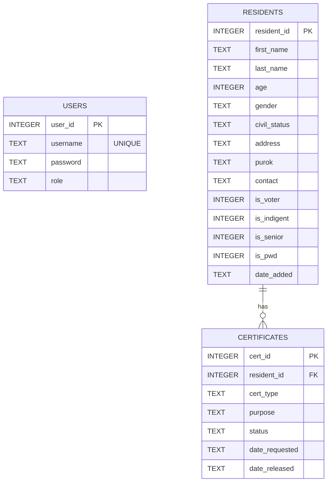

# Barangay Record Management System (BRMS)

A desktop-based information system developed in Java with SQLite database integration, designed for local barangay offices in the Philippines to manage resident records and certificate issuance processes. This project demonstrates the practical application of core Object-Oriented Programming (OOP) concepts.

---

## 📋 Table of Contents

1. [Features](#-features)
2. [OOP Concepts Applied](#-oop-concepts-applied)
3. [Database Design](#-database-design)
4. [Project Structure](#-project-structure)
5. [Prerequisites](#-prerequisites)
6. [Compilation & Execution](#-compilation--execution)
7. [Default Credentials](#-default-credentials)

---

## ✨ Features

- **🔑 Secure Login Module**: Staff authenticate using a username and password stored in the SQLite database, with input validated via `PreparedStatement` to prevent SQL injection and authentication attempts limited to 3.
- **👥 Resident Record Management (CRUD)**: Easily add, view, search, update, and delete resident records. Supports tagging residents with demographic indicators such as *Indigent*, *Senior Citizen*, *PWD*, and *Registered Voter* (with automatic senior citizen detection for age 60+).
- **📄 Certificate Request & Tracking**: Link certificate requests directly to residents via their Resident ID. Supports three certificate types:
  - **Barangay Clearance**
  - **Certificate of Indigency**
  - **Certificate of Residency**
  Tracks request status from **Pending** to **Approved** to **Released** (automatically stamping `date_released`).
- **📊 Report Generation**: Generates operationally meaningful reports printed to the console:
  1. *Population Distribution per Purok* (with status tag counts).
  2. *Certificate Request Trends* (monthly counts and status breakdowns).
  3. *Age Group & Demographic Breakdown* (percentage share and key insights).
- **🔌 Offline-Capable**: Powered by SQLite via JDBC, requiring no server or internet connection.

---

## 🛠️ OOP Concepts Applied

The system implements the seven core Object-Oriented Programming principles:

| OOP Concept | Application Details |
| :--- | :--- |
| **Abstraction** | Abstract parent classes `Person` and `CertificateRequest` define templates and enforce contracts via abstract methods like `getRole()`, `getCertificateType()`, and `generateDetails()`. |
| **Encapsulation** | All fields are declared `private` with access controlled strictly via public getter and setter methods. |
| **Inheritance** | Two clean class hierarchies: `Person` ➔ `Resident` ➔ `Official` (3-level chain) and `CertificateRequest` ➔ `BarangayClearance` / `IndigencyCertificate` / `CertificateOfResidency`. |
| **Polymorphism** | Runtime polymorphism demonstrated through method overriding (`toString()`, `getRole()`, `generateDetails()`) resolved dynamically. |
| **Constructors** | Default and parameterized constructors are defined in all classes with chaining implemented via `super()`. |
| **Exception Handling** | `try-catch` and `try-with-resources` protect database operations against `SQLException` and inputs against `NumberFormatException`. |
| **Collections** | `ArrayList` collections are used to hold and manipulate query results in the View, Search, and Report modules. |

---

## 🗄️ Database Design

The database consists of three tables defined in `barangay.db`:



---

## 📁 Project Structure

```
oop-brgy-system/
├── README.md
├── .gitignore
└── BarangaySystem/
    ├── barangay_schema.sql
    ├── project-overview.md
    ├── lib/
    │   ├── sqlite-jdbc-3.45.1.0.jar
    │   ├── slf4j-api-2.0.9.jar
    │   └── slf4j-simple-2.0.9.jar
    ├── src/
    │   └── (Java source files)
    └── out/
        └── (Compiled .class files)
```

---

## ⚙️ Prerequisites

- **Java Development Kit (JDK) 17 or higher** (e.g., OpenJDK Temurin)
- **Git** (for version control)

---

## 🚀 Compilation & Execution

Open your terminal, navigate to the `BarangaySystem` directory, and run the following commands:

### 1. Compile the Project
```powershell
javac -encoding UTF-8 -cp "lib/sqlite-jdbc-3.45.1.0.jar;lib/slf4j-api-2.0.9.jar;lib/slf4j-simple-2.0.9.jar" -d out src/*.java
```
> **Note**: The `-encoding UTF-8` parameter is required to properly render the box-drawing characters used in the command-line menus.

### 2. Run the Application
```powershell
java -cp "out;lib/sqlite-jdbc-3.45.1.0.jar;lib/slf4j-api-2.0.9.jar;lib/slf4j-simple-2.0.9.jar" Main
```

---

## 🔑 Default Credentials

Use the following credentials to log in during the initial run:

* **Username**: `admin`
* **Password**: `admin123`
